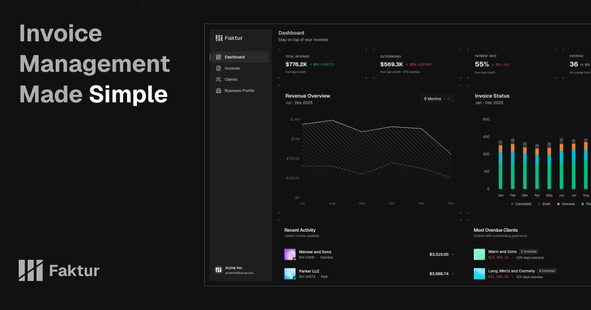

# Faktur

**Modern Invoice Management Made Simple**

A streamlined invoice management system for businesses of all sizes. Create, manage, and track invoices effortlessly with a beautiful, intuitive interface.



## What is Faktur?

Faktur is a full-stack invoice management application that helps you:

- ✨ Create and manage professional invoices
- 📊 Track payments and outstanding balances
- 👥 Manage clients and their billing information
- 📈 Visualize revenue with analytics dashboard
- 📄 Generate PDF invoices with custom branding
- 💼 Store your business profile and bank details

Built with modern web technologies for a fast, reliable, and beautiful experience.

## Tech Stack

- **Next.js 16** - React framework with App Router
- **TypeScript** - Type-safe development
- **PostgreSQL** - Robust database
- **Drizzle ORM** - Type-safe database queries
- **tRPC** - End-to-end type-safe APIs
- **Better Auth** - Modern authentication
- **Tailwind CSS v4** - Utility-first styling
- **shadcn/ui** - Beautiful UI components

## Getting Started

### Prerequisites

Before you begin, make sure you have:

- **Node.js 18+** - [Download here](https://nodejs.org/)
- **pnpm** - Fast, disk space efficient package manager
- **PostgreSQL** - Database server

### Install pnpm

If you don't have pnpm installed:

```bash
npm install -g pnpm
```

Or using other methods: https://pnpm.io/installation

### Setup PostgreSQL

1. **Install PostgreSQL:**

   - macOS: `brew install postgresql@15`
   - Ubuntu: `sudo apt install postgresql`
   - Windows: Download from [postgresql.org](https://www.postgresql.org/download/)

2. **Start PostgreSQL:**

   ```bash
   # macOS
   brew services start postgresql@15

   # Ubuntu
   sudo systemctl start postgresql
   ```

3. **Create database:**
   ```bash
   psql postgres
   CREATE DATABASE faktur_dev;
   \q
   ```

### Installation

1. **Clone the repository:**

   ```bash
   git clone <repository-url>
   cd faktur
   ```

2. **Install dependencies:**

   ```bash
   pnpm install
   ```

3. **Set up environment variables:**

   ```bash
   cp .env.example .env.local
   ```

4. **Configure your `.env.local`:**

   ```env
   # Update with your PostgreSQL credentials
   DATABASE_URL=postgresql://postgres@localhost:5432/faktur_dev

   # Generate a secure secret
   BETTER_AUTH_SECRET=your-secret-key-here
   BETTER_AUTH_URL=http://localhost:3000

   # Optional: OAuth providers
   GOOGLE_CLIENT_ID=your-google-client-id
   GOOGLE_CLIENT_SECRET=your-google-client-secret
   ```

5. **Push database schema:**

   ```bash
   pnpm db:push
   ```

6. **Start development server:**

   ```bash
   pnpm dev
   ```

7. **Open your browser:**
   Navigate to [http://localhost:3000](http://localhost:3000)

## Available Commands

```bash
# Development
pnpm dev          # Start development server
pnpm build        # Build for production
pnpm start        # Start production server
pnpm lint         # Run ESLint

# Database
pnpm db:push      # Push schema changes to database
pnpm db:studio    # Open Drizzle Studio (database GUI)
pnpm db:seed      # Seed database with sample data (development)
pnpm db:reset     # Reset database (WARNING: deletes all invoice, profile and clients data data)
```

## Production Deployment

1. Set `NEXT_PUBLIC_APP_URL` to your production URL
2. Update `DATABASE_URL` with production PostgreSQL credentials
3. Generate a secure `BETTER_AUTH_SECRET`
4. Run `pnpm build` and deploy

---

## License

MIT License - Free to use for personal and commercial projects.
